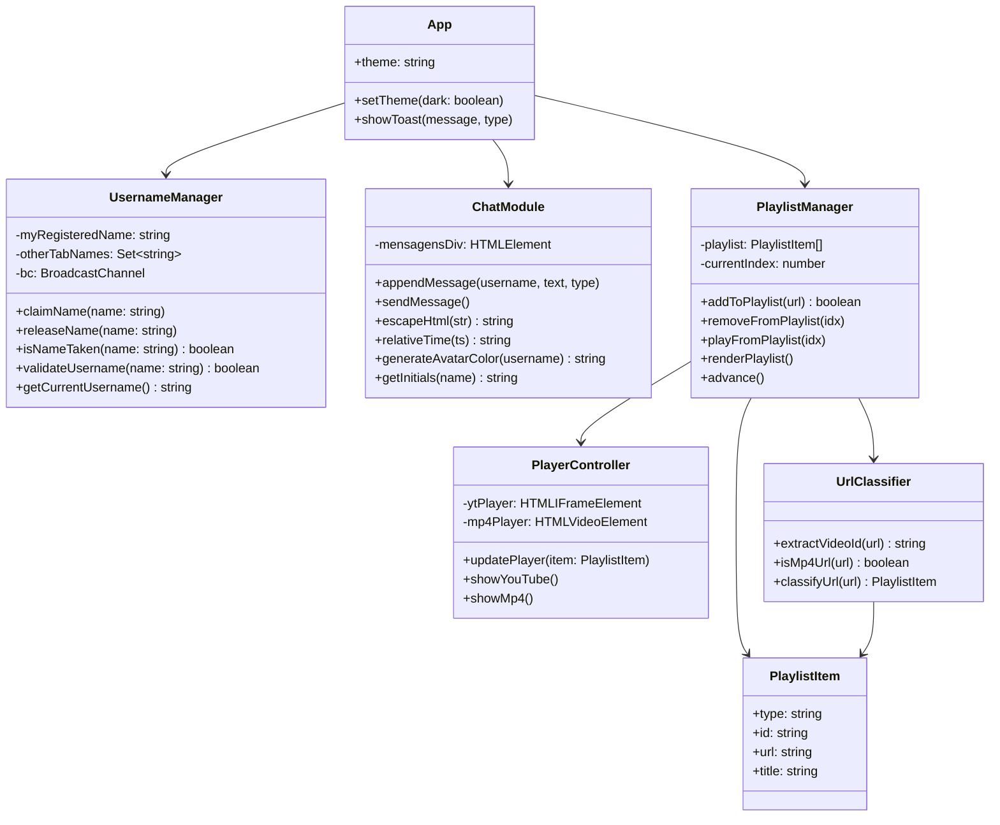
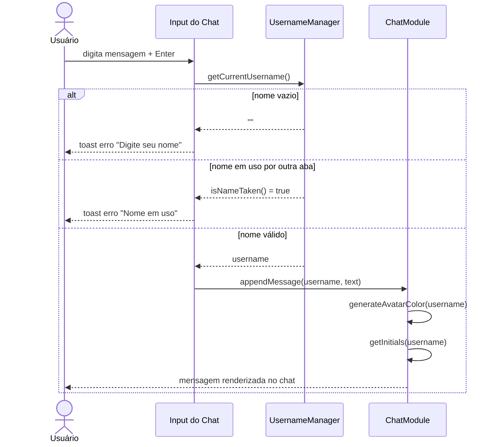
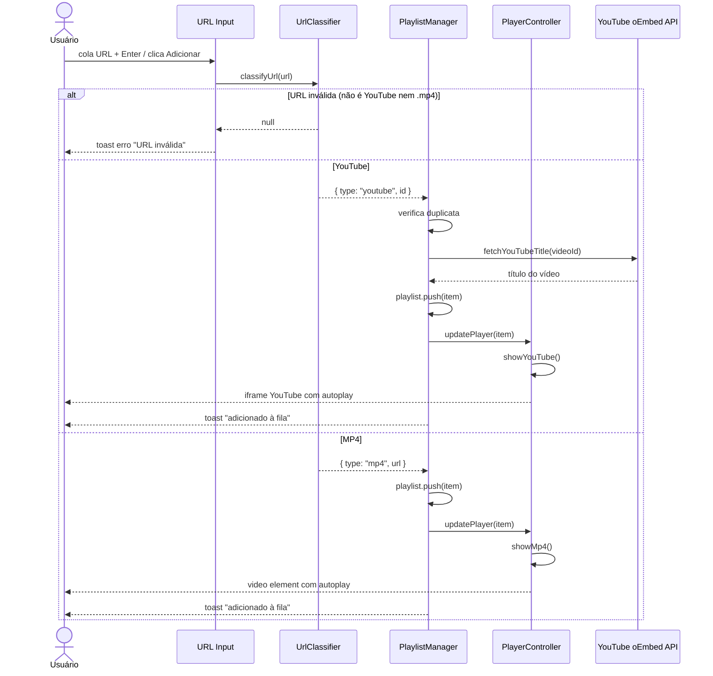
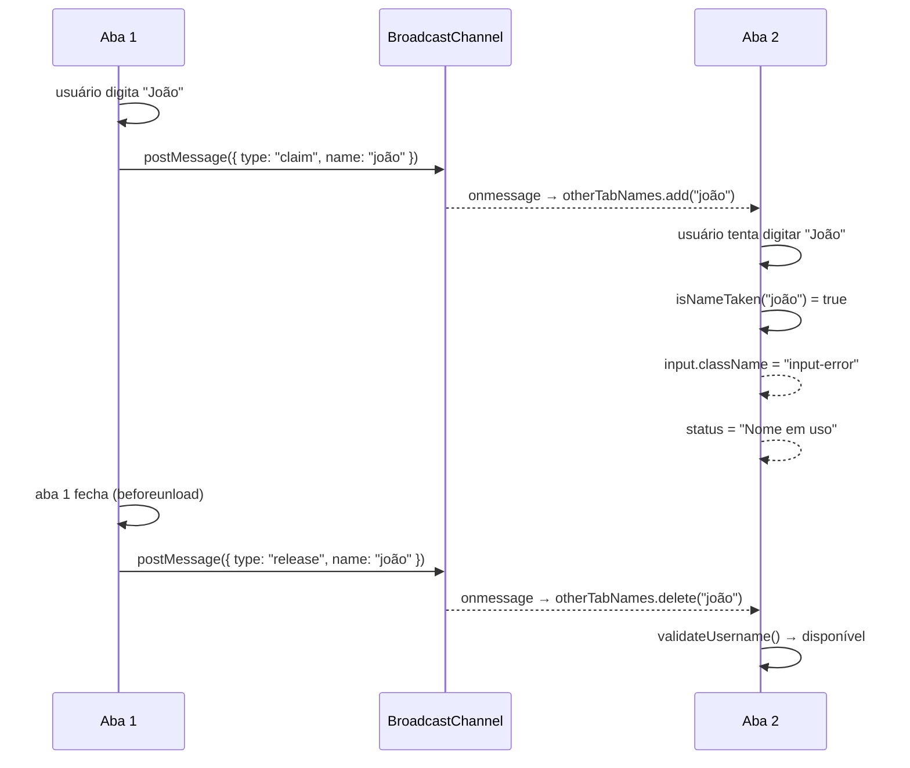
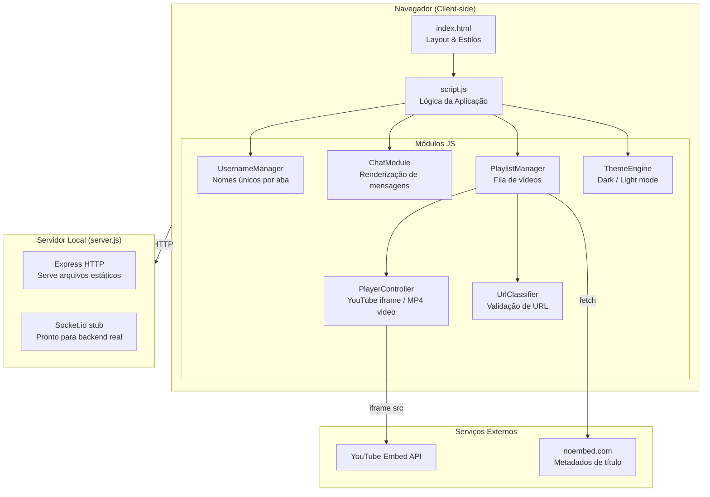
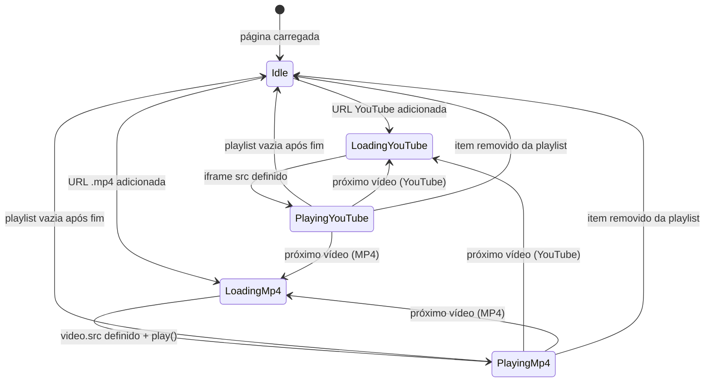

# Inusualchat — UML Diagrams

## 1. Diagrama de Classes

---

## 2. Diagrama de Sequência — Envio de Mensagem

---

## 3. Diagrama de Sequência — Adicionar Vídeo à Playlist

---

## 4. Diagrama de Sequência — Unicidade de Nome (Multi-aba)

---

## 5. Diagrama de Componentes

---

## 6. Diagrama de Estados — Player de Vídeo

